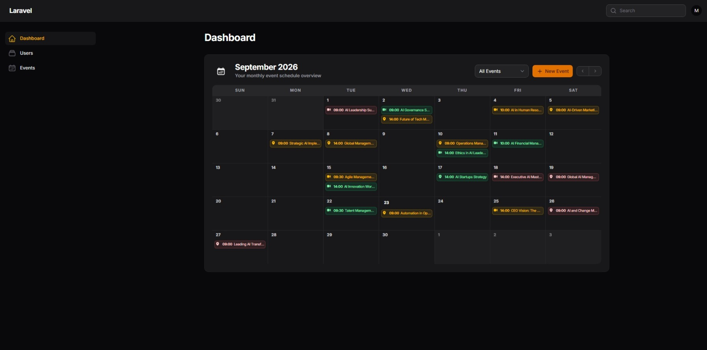
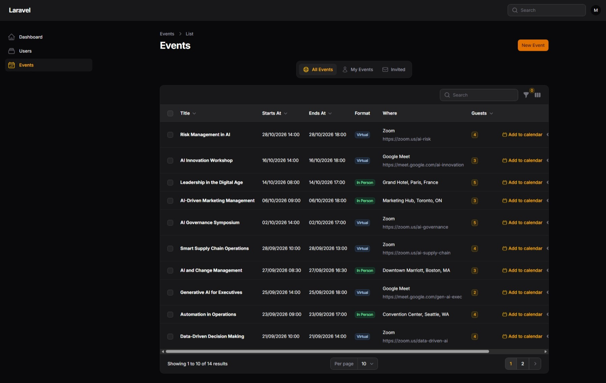
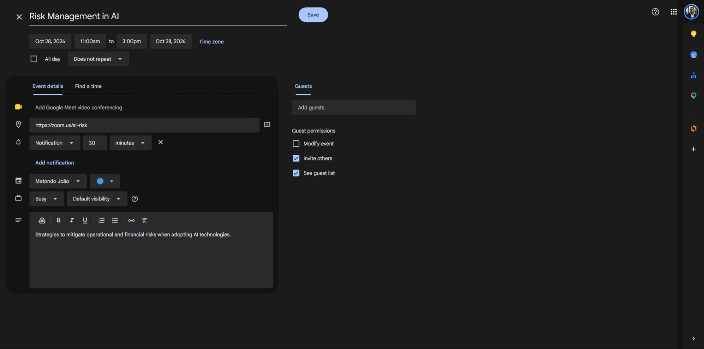

# Filament Event Calendar

A professional, fully customizable, and responsive event management plugin designed specifically for Filament v5.

## Screenshots

**Calendar Dashboard Widget:**


**Events Table & Views:**


**Google Calendar Integration:**


## Features

- **In-Person and Virtual Events:** Create physical events with locations, or virtual meetings with direct links (Google Meet, Zoom, Teams, etc.).
- **Smart Visibility & Invitations:** Users only see events they created or events they have been explicitly invited to.
- **RSVP Tracking:** Invited users can confirm or decline their presence directly through the calendar.
- **Automated Email Notifications:** The system sends an email invitation automatically when users are added to an event.
- **Daily Reminders:** Configurable job to send warnings 24 hours before an event starts.
- **Google Calendar Integration:** Allows attendees to add the event (including dates, description, and link/location) directly to their personal Google Calendar with a single click.
- **Perfect UI Integration:** Matches the native Filament v5 Zinc theme seamlessly in both Light and Dark modes.

## Requirements

- PHP 8.2+
- Laravel 13.0+
- Filament v5

## Installation

You can install the package via Composer:

```bash
composer require matondojk/filament-event-calendar
```

Publish and run the migrations to create the required database tables (`events` and `event_user`):

```bash
php artisan vendor:publish --tag="filament-event-calendar-migrations"
php artisan migrate
```

Optionally, you can publish the configuration file to customize the resource visibility and menu sorting:

```bash
php artisan vendor:publish --tag="filament-event-calendar-config"
```

## Plugin Registration

To use the event resource and the calendar widget, you must register them in your Filament panel configuration.

Open your `app/Providers/Filament/AdminPanelProvider.php`:

1. Register the plugin to load the Events management resource.
2. Register the `CalendarWidget` manually in the `widgets()` array. This gives you full control over the widget's position on your dashboard!

```php
use Matondojk\FilamentEventCalendar\FilamentEventCalendarPlugin;
use Matondojk\FilamentEventCalendar\Widgets\CalendarWidget;

public function panel(Panel $panel): Panel
{
    return $panel
        // ...
        ->plugins([
            // 1. Register the plugin here!
            FilamentEventCalendarPlugin::make(),
        ])
        ->widgets([
            Widgets\AccountWidget::class,
            Widgets\FilamentInfoWidget::class,
            // 2. Register the calendar widget here! (You can change its position)
            CalendarWidget::class, 
        ]);
}
```

## Scheduling Reminders

The package includes a job (`EventReminderJob`) that checks for upcoming events exactly 24 hours before they start. It sends both database notifications and email reminders to all confirmed or pending guests.

To enable this feature, you must schedule the job to run hourly. 

Add the following to your `routes/console.php` (Laravel 11+):

```php
use Matondojk\FilamentEventCalendar\Jobs\EventReminderJob;
use Illuminate\Support\Facades\Schedule;

Schedule::job(new EventReminderJob)->hourly();
```

*Note: Ensure your server has the Laravel scheduler configured (cron).*

## Configuration

If you published the configuration file, it will be located at `config/filament-event-calendar.php`. 

You can define if the `EventResource` should appear in the left sidebar, in which position, and whether automated emails should be dispatched:

```php
return [
    // Determine if the Events link should appear in the navigation menu.
    'should_register_navigation' => true,

    // Set the navigation sort order for the Events link.
    'navigation_sort' => 1,

    // Determine if invitation emails should be sent automatically when a user is added to an event.
    'send_invitation_emails' => true,
];
```

## Queues & Performance

This package heavily relies on background jobs (like `SendEventInvitationJob` and `EventReminderJob`) to send emails without slowing down your application.

**Highly Recommended:** Ensure you have a Queue worker running on your server (e.g., `php artisan queue:work`, or configure Supervisor/Horizon). If you do not configure queues, your application will send emails synchronously, which may cause slow page loads when creating events with many participants.

If you don't want to send automatic email invitations at all, you can disable them by setting `'send_invitation_emails' => false` in the configuration file.

## Usage Concepts

### Visibility and Privacy
Privacy is built-in by default. When an event is created, it belongs to the creator. The event will only appear on the calendar and table of the creator and the guests selected in the "Participants" field. The filtering tabs allow users to quickly switch between "All Events", "My Events", and "Invited".

### Google Calendar Integration
When an event is viewed, a button to "Add to Google Calendar" is presented. This button dynamically generates a URL populated with the event's title, description, start/end dates, and location (or virtual meeting link). Clicking it opens the Google Calendar creation page pre-filled.

## Support the Project

If you find this plugin useful, please consider leaving a star on the GitHub repository. Your support helps the project grow and reach more developers!

## License

The MIT License (MIT).
